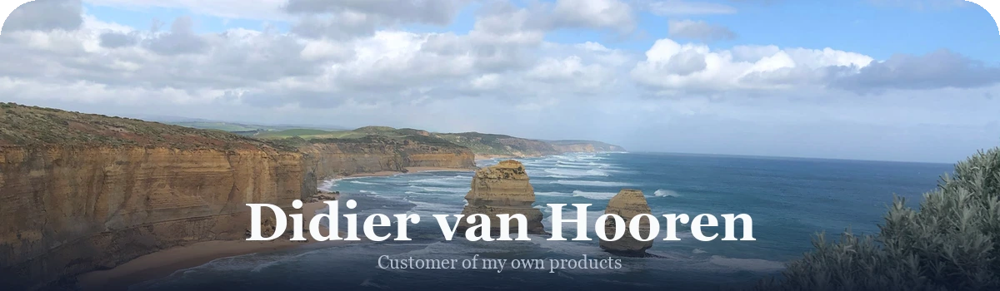

<picture>
<source media="(prefers-color-scheme: dark)" srcset="assets/banner-dark.webp" />
<source media="(prefers-color-scheme: light)" srcset="assets/banner-light.webp" />

</picture>

### About Me

- Customer of my own products
- Primary languages: **TypeScript**, **Python**, **SQL**
- Interests: AI workflows, agentic development, automation, iOS

 

          

### GitHub Stats

<picture>
<source media="(prefers-color-scheme: dark)" srcset="https://streak-stats.demolab.com?user=DidiervanH&theme=tokyonight&hide_border=true&background=00000000" />
<source media="(prefers-color-scheme: light)" srcset="https://streak-stats.demolab.com?user=DidiervanH&theme=default&hide_border=true&background=00000000" />

</picture>

### Projects

#### Personal

| Project | Description |
| --- | --- |
| [**dev-footprint**](https://github.com/DidiervanH/dev-footprint) | Audit developer tool disk usage on macOS — find what's eating your disk and reclaim space safely. |

*+ 14 private repositories*

#### Organisations

#### [@Nexus-Automations](https://github.com/Nexus-Automations)

*+ 6 private repositories*

#### [@ellie-languages](https://github.com/ellie-languages)

*+ 9 private repositories*

### Contributions

<picture>
<source media="(prefers-color-scheme: dark)" srcset="https://raw.githubusercontent.com/DidiervanH/DidiervanH/output/profile-night-view.svg" />
<source media="(prefers-color-scheme: light)" srcset="https://raw.githubusercontent.com/DidiervanH/DidiervanH/output/profile-green-animate.svg" />

</picture>

